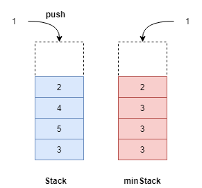
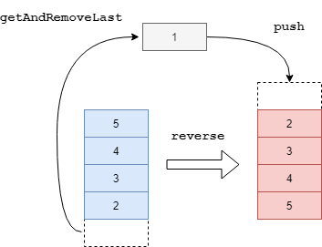
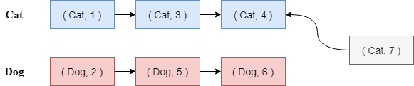

# 第 1 章 栈与队列


##### **题目 1：**设计一个有getMin功能的栈

- 要求：push，pop，getMin（返回栈中最小元素）的时间复杂度均为O(1) .（CD5，LeetCode 155)

- 题解 ：当 push 或 pop 操作时，原栈中的最小元素可能发生变动。要在常数时间内获取最小元素，则需要维护一个数据结构用于存    储每次操作后原栈中的最小元素。minStack 的栈顶元素为当前栈中的最小元素。据此设计push，pop 的附加操作维护 minStack




##### **题目 2：**由两个栈组成队列

- 要求：用两个栈实现队列 . （CD6，LeetCode 232）
- 题解 ：当push 或 pop 时，使用另外一个栈来回倒序元素实现先进先出，据此设计 push 和 pop 操作


##### **题目 3：**逆序一个栈

- 要求：使用递归函数和栈操作不申请其他数据结构（CD7）

- 题解：通过递归来保存栈中元素，缩小栈的规模 .

  reverse 函数：将栈底元素取出（并从原栈中删除，getAndRemoveLast 函数），再逆序剩余元素，之后将原栈底元素放在栈顶；

  getAndRemoveLast 函数：弹出并保存栈顶元素，（对剩余的栈）取出栈底元素；

  注意递归基的设计：栈为空，或者只有一个元素时；




##### **题目 4：**猫狗队列

- 要求：实现Pet，Dog，Cat 类，其中：

  1. add：将Cat 或 Dog类的实例放入队列中；

  2. pollAll：按照先进先出的次序弹出所有实例；

  3. pollDog：按照先进先出的次序弹出所有Dog；

  4. pollCat：按照先进先出的次序弹出所有Cat （CD100，LeetCode 动物收容所）.

- 题解：常见的错误方法是使用三个队列，分别用于存储Total、Dog、Cat实例，错误的原因在于当Dog或Cat弹出时，需要更新 Total 队列这一点极为不便。有没有什么办法来代替Total队列，并且同时能确定两个实例的先后顺序呢？使用时间戳。使用Dog 和 Cat 队列分别存储Dog和Cat实例，每入队一个实例，同时赋予实例一个时间戳；不同的队列中，数值小的实例为先入队的实例。




##### **题目 5：**栈排序

- 要求：只能申请一个栈和新的变量，不能申请其他数据结构. （CD13，LeetCode 栈排序）

- 题解：一种方法是使用递归的方法，但这种方法有作弊的嫌疑；另一种方法是申请辅助栈 help 对原栈 stack 进行排序，在stack上不断执行pop操作，记弹出的元素为curr，将curr压入help中，维护 help 中的元素始终为上小下大（循环不变式）：
  - 如果curr 小于或等于help的栈顶元素，则curr直接压入help；
  - 如果curr大于help的栈顶元素，则不断将help的栈顶元素弹出并压入stack中，直到curr小于或等于help的栈顶元素，将curr压入help中（整个过程类似于在help栈中进行插入排序）；


##### **题目 6：**用栈来求解汉诺塔问题

- 要求：我没有读懂题意（CD22）

- 题解：我没有读懂题意，好吧，我承认我是不想做这道题


##### **题目 7：**生成窗口最大值数组

- 要求：给你一个整数数组 nums，有一个大小为 k 的滑动窗口从数组的最左侧移动到数组的最右侧。你只可以看到在滑动窗口内的 k 个数字。滑动窗口每次只向右移动一位。返回滑动窗口中的最大值。（CD15，LeetCode 239）

  ```
  示例1
      输入：nums = [1,3,-1,-3,5,3,6,7], k = 3
  	输出：[3,3,5,5,6,7]
  	解释：
  	滑动窗口的位置                最大值
  	---------------             -----
  	[1  3  -1] -3  5  3  6  7      3
   	1 [3  -1  -3] 5  3  6  7       3
   	1  3 [-1  -3  5] 3  6  7       5
   	1  3  -1 [-3  5  3] 6  7       5
   	1  3  -1  -3 [5  3  6] 7       6
   	1  3  -1  -3  5 [3  6  7]      7
  ```

- 题解 ：


